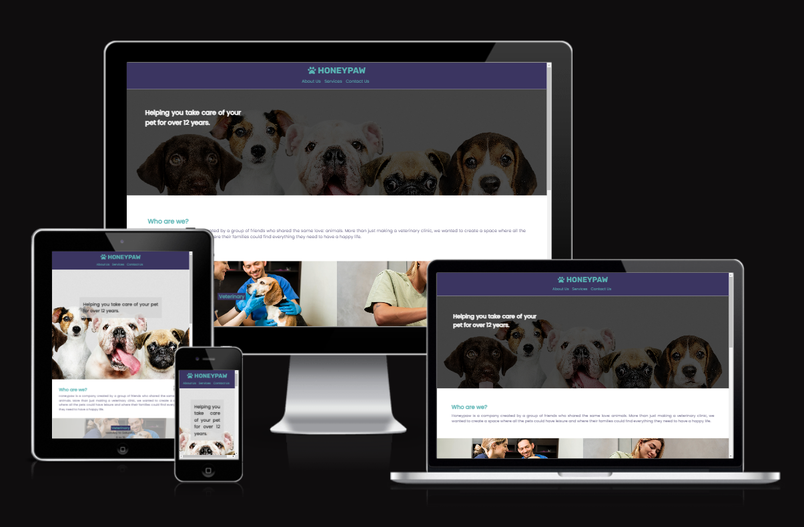
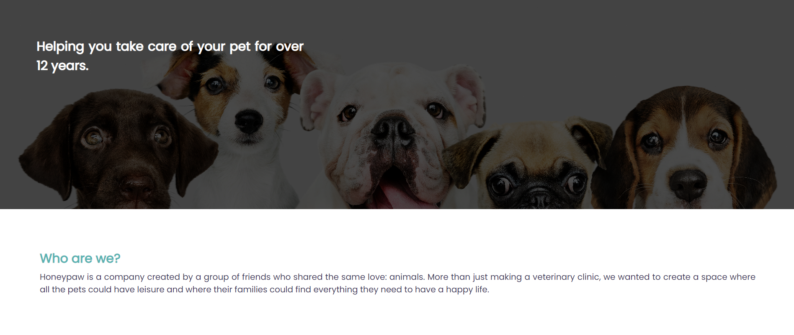
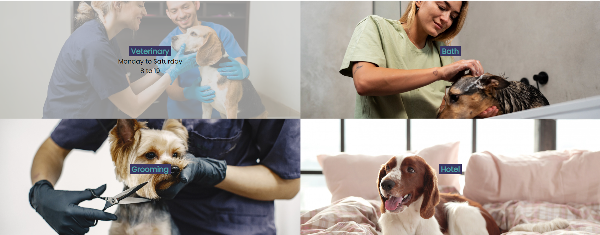
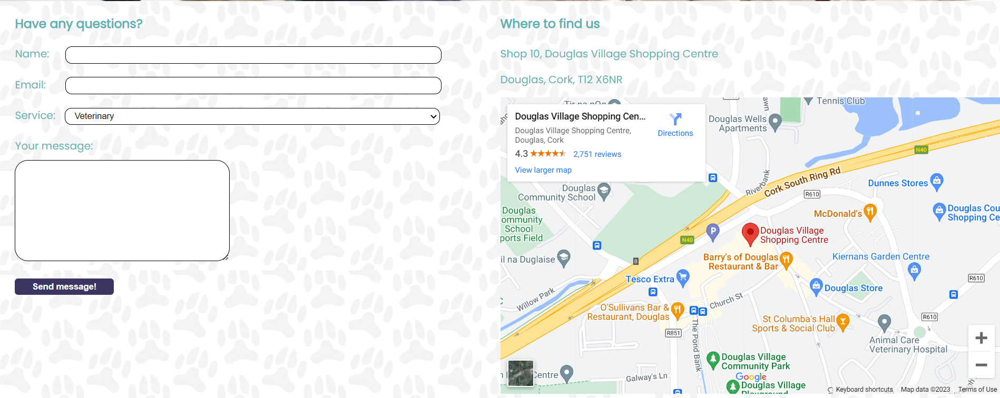
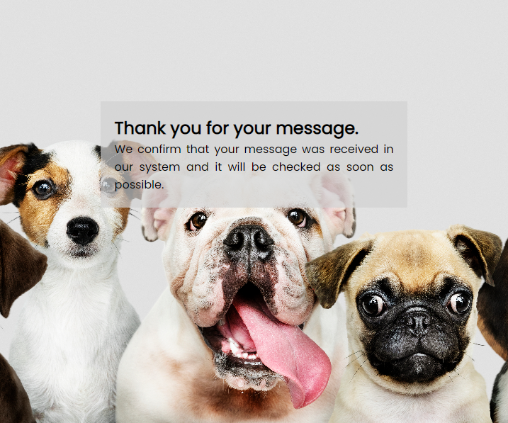
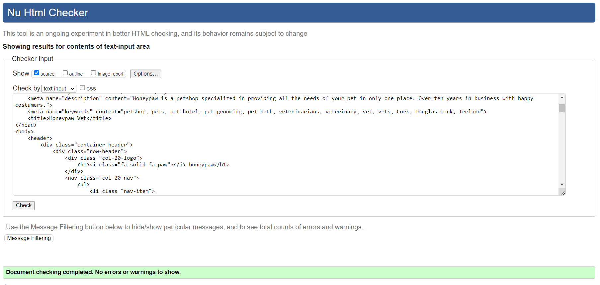
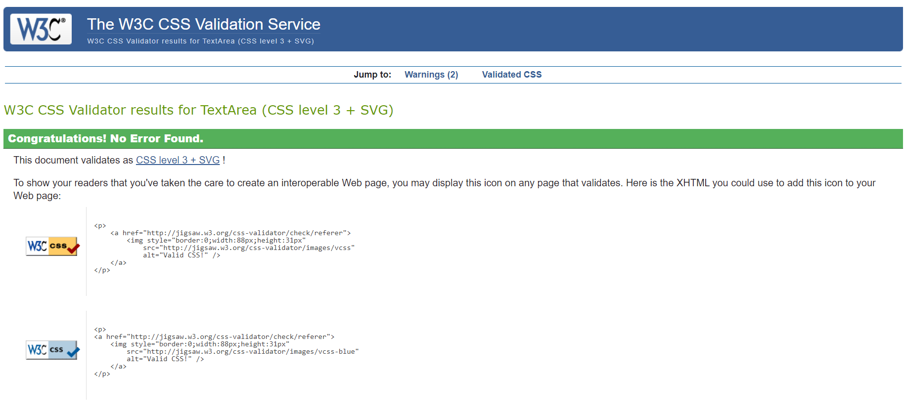
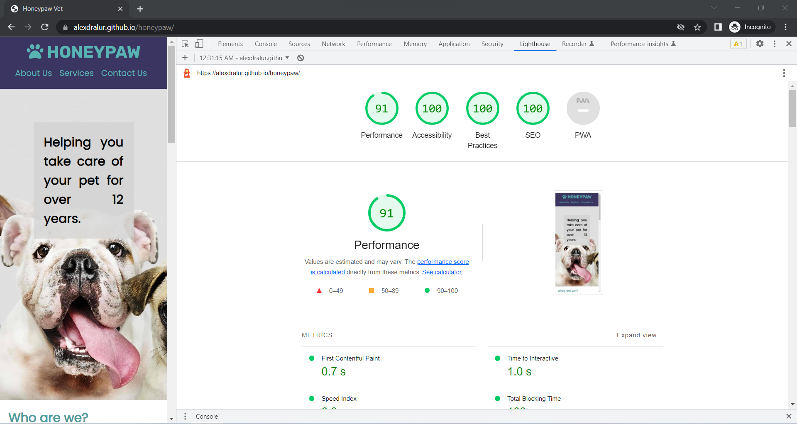

# **HONEWPAY**
## **Site Overview**
The Honeypaw website was designed having in mind a veterinary shop that also has a petshop. It is located in Douglas, Cork, and it has 12 years in business. It is located in the Shopping Centre, a big spot in the area and it is focused on Corkians who have pets and need a vet to take their animals to and also to buy food, toys or even let them stay on the hotel while they go on holiday.

​
## Table of contents:
1. [**Site Overview**](#site-overview)
1. [**Planning stage**](#planning-stage)
    * [***Target Audiences***](#target-audiences)
    * [***User Stories***](#user-stories)
    * [***Site Aims***](#site-aims)
    * [***Color Scheme***](#color-scheme)
    * [***Typography**](#typography)
1. [**Current Features Common to all pages**](#current-features-common-to-all-pages)
    * [***Header Element:***](#header-element)
    * [***About Us:***](#about-us)   
    * [***Services***](#services)
    * [***Contact Us***](#services)
    * [**Footer**](#footer)
    * [**Thank You**](#thankyou)
1. [**Future-Enhancements**](#future-enhancements)
1. [**Testing Phase**](#testing-phase)
1. [**Deployment**](#deployment)
1. [**Tech**](#tech)
1. [**Credits**](#credits)
    * [**Honorable mentions**](#honorable-mentions)
    * [**General reference**](#general-reference)
    * [**Content**](#content)
    * [**Media**](#media)
​
## **Planning stage**
### **Target Audiences:**
​
* Users interested in petshops.
* Users interested in veterinarians in Cork.
* Users interested in pets.
​
### **User Stories:**
​​
* As a user, I want to see the subject matter of the page.
* As a user, I want to navigate the page to find what I require quickly and easily.
* As a user, I want to learn more about what the business offers
* As a user, I want to reach out and contact the business
​
### **Site Aims:**
​
* To provide an trustworthy veterinarians in Cork with over 10 years in business.
* To inform which type of services Honeypaw offers.
* To inform where the users can find us.
* To offer the user an oppertunity to get in contact.
​
### **Color Scheme:**
​
The objective of the colors of the site was to bring some joy to the user. Pets are always related to happiness, so (#3B3561) was used for the main backgrounds and (#59B3B3) was used for the the text and social media icons.
​
## **Typography**
​
* Throughout the page, there are three fonts used:
  * Rubik - For the logo. It gives a strong image, however, does not seems distant or impersonal.
  * Poppins - For all the other text in the website.
​
* Both fonts were used to complement eachother. They provide clean visuals regardless of the screensize.
* All fonts were sourced from Google fonts, as stated in the credits.
​
## **Current Features Common to all pages**
​
#### *Navigation Bar:*

* The navigation bar is divided in two sections: the logo and the areas of the page
* Each area, when hovered, changes color to provide clarity that it will bring the user to that section
* Due to the conciseness of the website, there was no necessity of changing the structure of the header depending on the screen size.

#### *About Us:*

* There are two parts to the About Us section: a hero image and a text description about Honeypaw.
* The hero image also has a text that appears on top of the image.

#### *Services:*

* There are four main services in Honeypaw: veterinary appointments, bath, grooming and the hotel.
* Each one of them has specific working hours.
* When viewed on tablet screens or higher, each service has a hover effect that only shows the days/hours when the mouse hover each one.

#### *Contact Us:*

* The contact us section is divided in two mini-sections: a form and a Google Maps iframe.
* On the form, the users can send their queries about each one of the services provided, or other if it is beyond that. They must provide a valid email and they must fill out the name and textarea to be able to send the message.
* On the iframe it is displayed the location of the Douglas Shopping Centre and right above it there is the typed details.

​
#### *Footer:*

* The footer has the logos for the main social media plataforms: Facebook, Twitter, Instagram and Youtube, with links that opens new tabs when clicked.

#### *Thank You:*

* After the user fills out the form and press send, they are taken to the thank you where they are informed that the message has been sent to the company and that it will be checked in due time.

​
## **Future-Enhancements**
​
* No Javascript was used for the website, so further tecnology can be applied, especially to the form section.
​
## **Testing Phase**
​
* Responsiveness - The website was accessed from both Samsung S20 FE and a Iphone 13 Pro Max. For the tablet screens, it was used an Ipad and the big screens were tested on a Macbook Air and on a Dell Latitude. It was checked on a monitor 21' size.
​
* Functionality - The main features of the website is the hover effects on the sevices area. When talking with my tutor, he highlighted that, most of the users, will acess the website by mobile, so the hover effect would not make sense. So, that function was also removed for these type of screens.
​
* Validators

. HTML [W3C HTML Validator](https://validator.w3.org/)

. CSS - [Jigsaw CSS Validator](https://jigsaw.w3.org/css-validator/)
​

. Google Lighthouse
​
​
## **Bugs**
​
Two main issues found when the project was being built was in relation to the div with the text above the hero image. Depending on the screen size, diferent styles had to be applied, especially on big screens, where the text would disappear on the background. To fix the issue, another div was added between the other ones to provide shading when on big screens.
​
***
## **Deployment**
I deployed the page on GitHub pages via the following procedure: -
​
1. From the project's [repository](https://github.com/AlexDralur/honeypaw), go to the **Settings** tab.
2. From the left-hand menu, select the **Pages** tab.
3. Under the **Source** section, select the **Main** branch from the drop-down menu and click **Save**.
4. A message will be displayed to indicate a successful deployment to GitHub pages and provide the live link.
​
You  can find the live site via the following URL - [live webpage](https://alexdralur.github.io/honeypaw/)
***
​
## **Tech**
​​
- HTML
- CSS
​
## **Credits**
### **Honorable mentions**
​
It's always nice to mention those that helped you get there, if people gave you support on slack or the local cat scared you into completing give them a mention!
​
### **Content:**
​
. Social media icons from footer took from FontAwesome.

. Social media HTML structure took from the Love Running project from Code Institute.
  
### **Media:**
​
Hero-image: <a href="https://www.freepik.com/free-psd/group-portrait-adorable-puppies_3730286.htm#query=PETS&position=3&from_view=search&track=sph">Image by rawpixel.com</a> on Freepik

Services images:

. <a href="https://www.freepik.com/free-photo/happy-female-vet-smiling-petting-beautiful-beagle-dog-exam-table-professional-veterinarian-man-holding-pet-while-examining-healthy-pet-clinic_27999717.htm#query=veterinary&position=0&from_view=search&track=sph">Image by tonodiaz</a> on Freepik

. Image by <a href="https://www.freepik.com/free-photo/side-view-woman-washing-dog_31231627.htm#query=dog%20bath&position=43&from_view=search&track=ais">Freepik</a>

. <a href="https://www.freepik.com/free-photo/haircuting-process-small-dog-sits-table-dog-with-professional_17066326.htm#query=dog%20grooming&position=4&from_view=search&track=ais">Image by prostooleh</a> on Freepik

. <a href="https://www.freepik.com/free-photo/dog-bed-morning_6978017.htm#query=hotel%20dog&position=26&from_view=search&track=ais">Image by Racool_studio</a> on Freepik

Contact us image: <a href="https://www.freepik.com/free-vector/abstract-pattern-design_1049012.htm#query=pet%20patterny&position=0&from_view=search&track=ais">Image by flatart</a> on Freepiks
